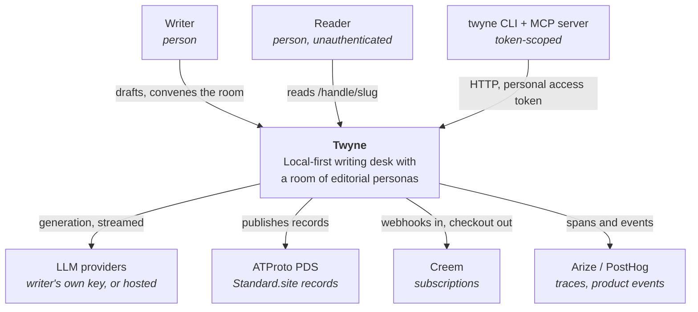
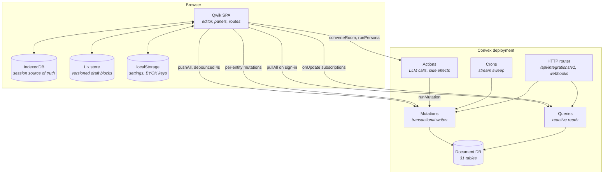
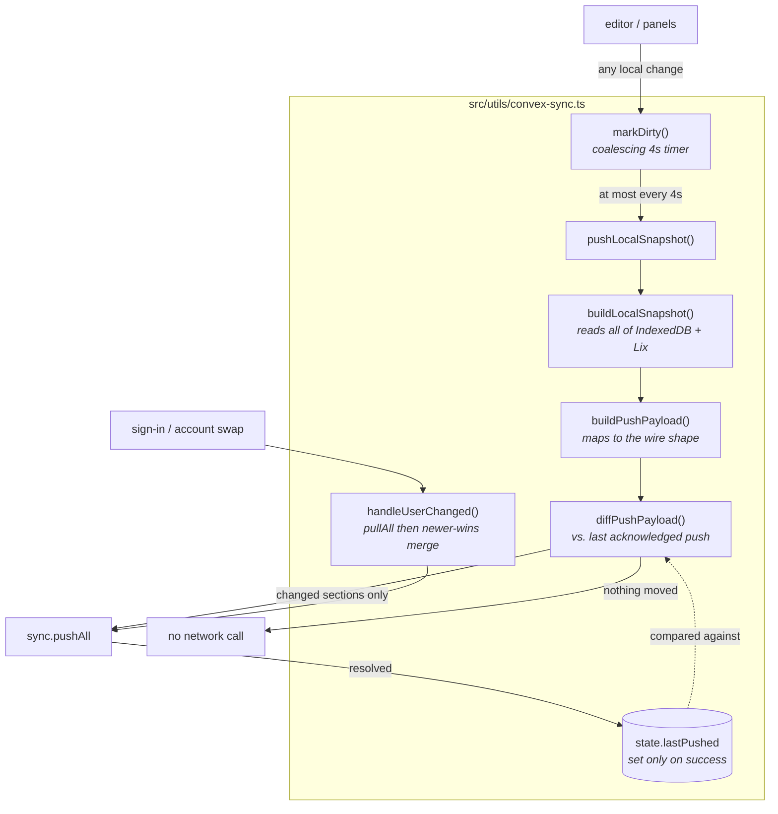
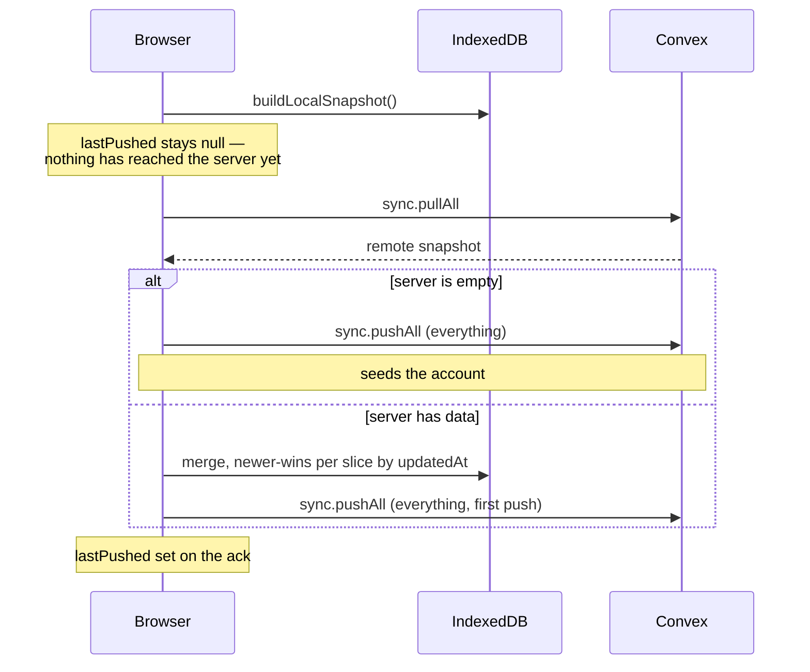
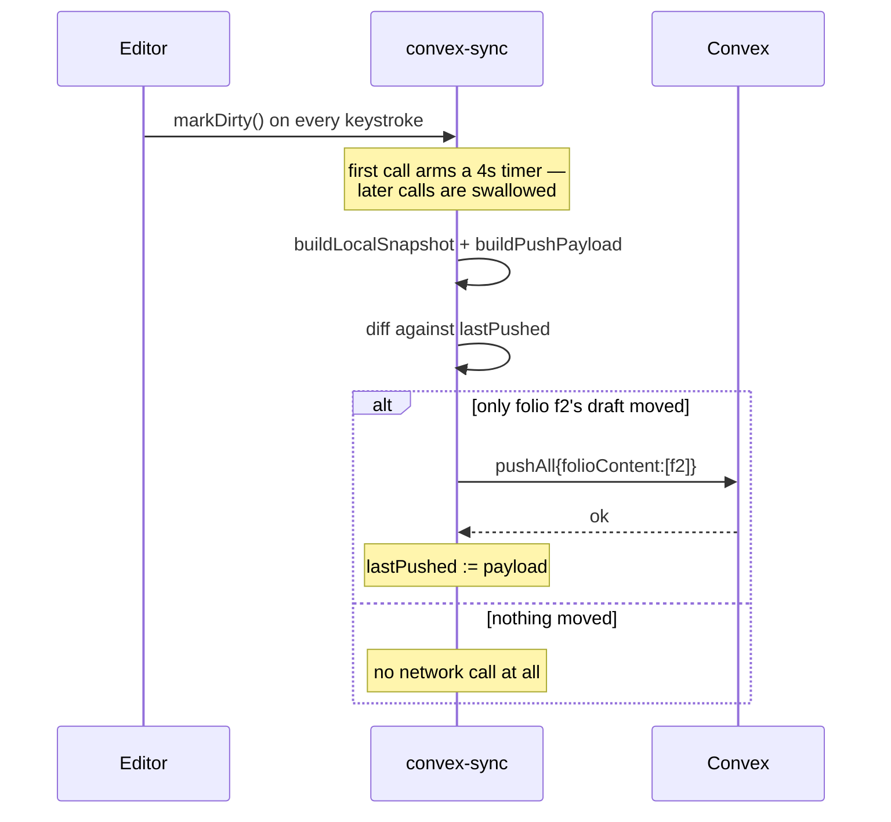
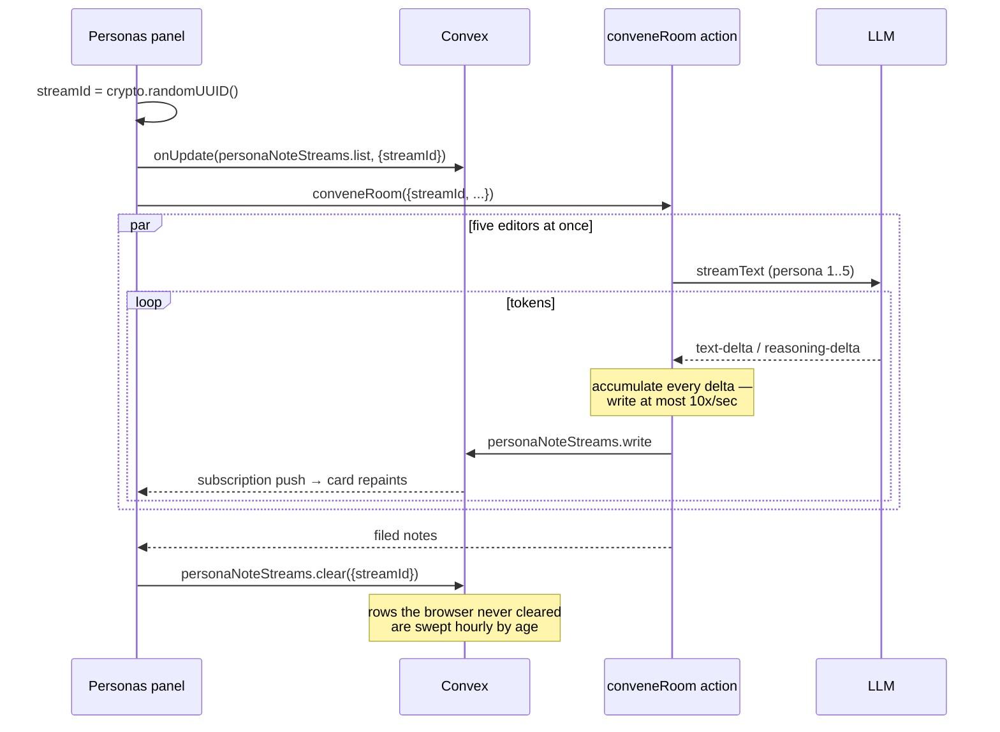

# Data & sync architecture

How a sentence typed in the editor reaches the database, what else writes to
that database, and where the arrangement is stranger than it looks.

Written against the working tree as of the 0.12.0 release preparation. Findings
are listed at the end with their status.

---

## C4 L1 — System context

## C4 L2 — Containers

The important asymmetry: **IndexedDB is the source of truth for the current
session; Convex is the source of truth across sessions.** Nothing in the editor
blocks on the network, and a signed-out writer never touches Convex at all.

## C4 L3 — Inside the sync component

`lastPushed` is the whole trick. It holds the payload the server has
**acknowledged**, not the one last built — so a push that threw leaves it
untouched and the next push carries the entire gap. It starts null on sign-in,
which is what makes the account-seeding path send everything.

---

## Where each kind of data actually lives

| Data | Local home | Convex table | Written by | Cadence |
|---|---|---|---|---|
| Draft HTML | IndexedDB + Lix | `folioContent` | snapshot push | ≤ every 4s, only if changed |
| Folio list | IndexedDB | `folioEntries` (row per folio) | snapshot push | ≤ every 4s, changed folios only |
| Dossier / brief | IndexedDB + Lix file | `briefs` | snapshot push | ≤ every 4s |
| Persona notes | IndexedDB | `personaNotes` | snapshot push **and** `putPersonaNote` | on file + every 4s |
| Replies | IndexedDB | `personaReplies` | snapshot push **and** `addPersonaReply` | on send + every 4s |
| Rubric results | IndexedDB | `rubricResults` | snapshot push | ≤ every 4s |
| Bibliography | Lix file | `bibliographyEntries` (row per entry) | snapshot push | ≤ every 4s, changed entries only |
| Custom personas | IndexedDB | `personaEntries` (row per persona) | snapshot push **and** `putCustomPersonas` | on edit + every 4s |
| Room settings | IndexedDB | `roomSettings` | `putRoomSettings` only | on change |
| Theme | IndexedDB | `appearance` | `putAppearance` only | on change |
| AI / writer settings | localStorage + IDB | — | never synced | — |
| Notes being generated | — | `personaNoteStreams` | server action | ≤ 10/s per persona |
| Interview turn | — | `dossierInterviewStreams` | server action | ≤ 10/s |
| Presence | — | `presence` | heartbeat | every 3s while collaborating |
| Writing streak | — | `writingActivity` | `recordActivity` | throttled to 2 min |
| Published pieces | — | `published` + PDS | publish flow | on publish |
| Lix snapshot blob | IndexedDB | `lixBlobs` | **nothing** (see finding 9) | never |

## Sequence — signing in

There is no CRDT and no operational transform. The merge is per-slice
newer-wins, and it runs **only at sign-in** — not continuously.

## Sequence — steady-state typing

## Sequence — a convened room, streaming

The action cannot push to the browser — it returns once, at the end. The
database is the only live channel, which is the entire reason `streamId`
exists: the client mints it, subscribes, *then* calls the action.

## Write-cadence budget

| Writer | Trigger | Peak rate |
|---|---|---|
| `pushAll` | typing | ≤ 15/min, changed rows only |
| `personaNoteStreams` | convened room | ≤ 10/s × 5 personas, for the length of a generation |
| `dossierInterviewStreams` | interview turn | ≤ 10/s |
| `presence` heartbeat | collaborating | 20/min per participant |
| `writingActivity` | typing | 0.5/min |
| `rateBuckets` | any rate-limited call | 1 per call |
| stream sweep | cron | ≤ 400 deletes/hour |

Note that the two `1.5s` and `4s` intervals in `collaboration.ts` and
`share-dialog.tsx` are **local** polls — Lix state and a dialog refresh — not
network writes.

---

## Findings

### Fixed in this cycle

**1. Streaming wrote once per token.** Both `streamNote` and the interview turn
loop awaited a Convex mutation inside `for await (const part of fullStream)`.
A convened room was up to ~1,900 transactions; the awaited write also applied
backpressure to reading the provider stream. Now gated by `createPublishGate`
at 100ms — the clock-based sibling of the browser's `createFrameCoalescer` —
which cuts it ~5× with no visible difference, since the reader repaints on a
frame either way. Terminal snapshots always pass the gate.

**2. `pushAll` re-read the whole replies table inside its own loop.** N replies
pushed × N collected = quadratic document reads in one transaction, in the path
that fires every 4s. Past a few hundred replies this stops being slow and
starts exceeding the transaction read limit — taking the draft sync down with
it. Now one `collect` and a `Set`, hoisted out of the loop.

**3. `pushAll` wrote everything, unconditionally.** Every 4s of typing rewrote
every folio's HTML, every note, every reply, every rubric result — whether or
not any of it had moved. `state.lastSnapshot` was assigned on every push and
never read. Now `lastPushed`, diffed per section, set only on acknowledgement.

**4. Abandoned stream rows accumulated forever.** A tab closed mid-generation
never ran `clear`. Added `by_updatedAt` indexes to both stream tables, an
hourly cron, and a bounded sweep.

### Open — worth deciding on before or after the release

**5. ~~Four tables hold one giant document each.~~ Fixed.** `folios`,
`customPersonas` and `bibliographies` each held an entire collection in one
document: every edit rewrote the whole thing, and the collection could never
outgrow Convex's 1MB cap. All three are now a row per item
(`folioEntries`, `personaEntries`, `bibliographyEntries`), behind one accessor
in `convex/lib/collections.ts`. The wire contract is unchanged — callers still
hand over and receive whole arrays — so no client protocol changed. Reads fall
back to the legacy document until the backfill reaches a user; writes migrate
that user and drop the legacy row. `lixBlobs` still holds an entire SQLite
database in one `v.bytes()` column, but nothing writes it (finding 9), so it
was left alone rather than migrated.

**6. Two independent write paths reach the same tables.** Persona notes,
replies, and custom personas are written both by the bulk snapshot push *and*
by granular mutations (`putPersonaNote`, `addPersonaReply`,
`putCustomPersonas`) called straight from components. Nothing coordinates them;
last writer wins. It is not currently causing corruption because both write the
same content from the same local state, but it is two sources of truth for one
row.

**7. The snapshot sync has no delete channel — now partly closed.** `pushAll`
still only upserts for `briefs`, `folioContent`, `personaNotes`,
`personaReplies` and `rubricResults`: a row deleted locally without the matching
`remove*` mutation stays on the server and comes back on the next sign-in. The
three migrated collections no longer have this problem — their arrays are sent
whole, so `writeCollection` treats an absent item as deleted and removes its
row.

**8. Merging happens once, at sign-in.** Two devices open at the same time do
not reconcile: neither subscribes to its own data, so each pushes over the
other, and neither sees the change until a reload. The reactive subscriptions
that exist are for generation streams and collaboration presence only.

**9. The Lix blob sync is dead code.** `syncToConvex` and `loadFromConvex` are
exported from `convex-sync.ts` and referenced by nothing but their own test.
The `lixBlobs` table therefore has no writer in production. Related: the
change-proposal path noted elsewhere as broken on the pinned SDK.

**10. `streamNote` can never write its `error` status.** There is no try/catch
around the stream loop, so a mid-generation failure leaves the row at
`"running"`. Harmless today — the client's `finally` clears both the store and
the rows — but the branch reads like a handled case and is not one.

**11. Streamed text and filed text can disagree under multi-step.** With
`stopWhen: stepCountIs(3)`, the accumulator sums text-deltas across all steps
while `await streamed.text` returns only the last step's. A model that emits
prose before calling `quote_passage` would show more in the card than lands in
the note. Rare; low severity.

**12. `runPersona` accepts a `streamId` no caller passes.** Both call sites
omit it, so the single-persona hosted path is plumbed for streaming that never
happens. Fine as groundwork; dead otherwise.

**13. `personas-markdown-wiring.test.ts` is red on `main`.** A source-string
matcher that has rotted, and this cycle's changes make one more of its
assertions stale. Failing before any of this work began.
