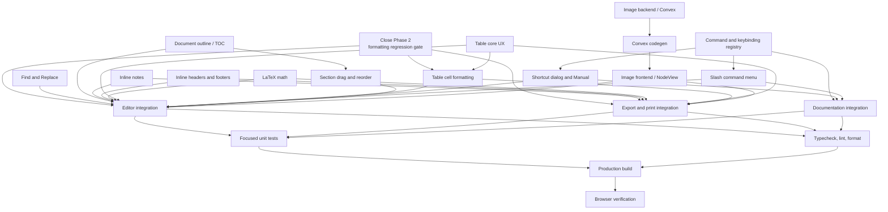
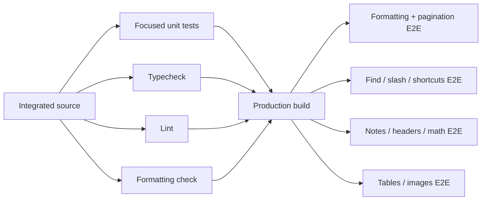
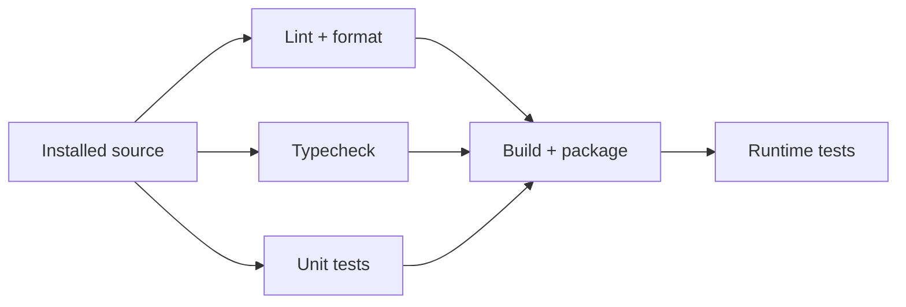

# Word-Class Editor: Parallel Build Graph

This document converts the remaining editor roadmap into a dependency-aware
execution graph. The previous phase numbering describes release milestones,
not implementation dependencies. Most feature slices can be built in parallel;
only shared contracts, central integration, generated code, and final
verification require serialization.

## Build graph



## Execution waves

| Wave | Parallel tasks | Gate |
|---|---|---|
| 0 | Finish Phase 2 regression checks | Formatting and colour-picker APIs stable |
| 1 | Command registry, Find/Replace, outline, inline notes, header/footer editor, math, table core, image backend | Focused tests pass for each module |
| 2 | Shortcut dialog, slash menu, section dragging, table shading, Convex codegen followed by image frontend | Foundation contracts available |
| 3 | Editor integration, export integration, documentation integration | Feature APIs stable |
| 4 | Focused tests, typecheck, lint, and formatting check in parallel | Integrated tree passes static and unit gates |
| 5 | Production build | Wave 4 passes |
| 6 | Independent browser suites | Built application available |

The longest critical path is:

```text
Image backend
  -> Convex codegen
  -> Image frontend
  -> central integration
  -> production build
  -> browser verification
```

Start the image backend early.

## Protected shared files

Workers must not race on these files:

- `src/components/editor/twyne-editor.tsx`
- `src/components/editor/page-chrome.tsx`
- `src/global.css`
- `src/utils/exchange.ts`
- `src/routes/docs/index.tsx`
- `package.json`
- `bun.lock`
- Convex generated files

These remain coordinator-owned during parallel implementation. Feature workers
should expose focused extensions, utilities, components, and tests; the
coordinator performs central registration and integration.

Pre-existing dirty files are protected. Workers must not revert or overwrite
unrelated changes made by the user or another worker.

## Agent contracts

### CR — Command and keybinding registry

- **Role:** worker
- **Depends on:** none
- **Owns:**
  - `src/utils/editor-commands.ts`
  - `src/utils/keybindings.ts`
  - Focused tests for both registries
- **Produces:**
  - Stable command IDs
  - Labels, descriptions, groups, and search terms
  - Keyboard shortcuts
  - Slash-menu metadata and shortcut hints
  - Availability predicates that do not depend on Qwik rendering
- **Must not edit:** editor component, Manual route, slash-menu component
- **Acceptance:**
  - IDs and shortcuts are unique
  - Platform shortcut labels render correctly
  - Registry supports filtering by command group and search query

### FR — Find and Replace

- **Role:** worker
- **Depends on:** none
- **Owns:**
  - `src/utils/find-replace.ts`
  - `src/components/editor/extensions/find-replace.ts`
  - `src/components/editor/find-replace-panel.tsx`
  - Focused tests
- **Produces:**
  - Pure match finder
  - ProseMirror decoration plugin
  - Find/Replace UI
  - Next, previous, replace, and replace-all commands
- **Must not edit:** central editor registration
- **Acceptance:**
  - Case-sensitive and whole-word modes
  - Optional regular-expression mode
  - Match counter and wraparound navigation
  - Search decorations never alter manuscript HTML or undo history

### OL — Document outline and table of contents

- **Role:** worker
- **Depends on:** none
- **Owns:**
  - `src/utils/document-outline.ts`
  - `src/components/editor/document-outline.tsx`
  - Focused tests
- **Produces:**
  - Stable heading/section model
  - Outline navigation component
  - Table-of-contents payload
- **Must not edit:** editor route layout or central editor component
- **Acceptance:**
  - Correct hierarchy for skipped heading levels
  - Stable identifiers for duplicate headings
  - Clicking an entry moves focus to the heading

### DR — Section drag and reorder

- **Role:** worker
- **Depends on:** OL
- **Owns:**
  - Section move/reorder utility
  - Drag-handle extension or component
  - Focused tests
- **Produces:** moving a heading and its subordinate section as one transaction
- **Must not edit:** outline implementation or central editor component
- **Acceptance:**
  - A section move is one undoable transaction
  - Nested sections move with their parent
  - Invalid self-drops are rejected

### NT — Inline footnotes and endnotes

- **Role:** worker
- **Depends on:** none
- **Owns:**
  - Note NodeView or inline note-popover component
  - Note editing utilities
  - Focused tests
- **Produces:**
  - Edit note text beside the reference
  - Change footnote to endnote and vice versa
  - Delete note
  - Navigate between reference and note
- **Must not edit:** export implementation or central editor registration
- **Acceptance:**
  - Escape returns focus to the note reference
  - Numbering remains derived from document order
  - Editing survives HTML round-trip and reopening

### HF — Inline headers and footers

- **Role:** worker
- **Depends on:** existing page-chrome contract
- **Owns:**
  - Header/footer inline editor
  - Page-furniture editing tests
- **Produces:** direct editing from the visible page band
- **Must not edit:** `page-chrome.tsx` or central editor component directly
- **Acceptance:**
  - Header and footer values persist through existing folio layout events
  - Keyboard focus and cancellation are predictable
  - Empty values restore the existing fallback behavior

### MA — LaTeX math

- **Role:** worker
- **Depends on:** none
- **Owns:**
  - Math extension
  - Math source editor
  - KaTeX-specific styles/assets in isolated files
  - Unit and rendering tests
- **Produces:**
  - Inline and block math nodes
  - Click-to-edit raw LaTeX
  - Portable serialized HTML
- **Must not edit:** package files, global stylesheet, central editor, export
- **Acceptance:**
  - Invalid LaTeX has a recoverable visible state
  - Math is keyboard editable
  - Block math is atomic for pagination
  - Assets work without a runtime CDN dependency

### TC — Table core UX

- **Role:** worker
- **Depends on:** none
- **Owns:**
  - Table insertion grid
  - Floating table toolbar
  - Table-format attributes and utilities
  - Focused tests
- **Produces:**
  - N-by-M table insertion
  - Discoverable row, column, merge, split, and delete actions
  - Table width/alignment and column distribution
  - Caption and style attributes
- **Must not edit:** central editor component, shared colour picker, export
- **Acceptance:**
  - Toolbar follows the active table
  - Actions correctly disable when unavailable
  - Table attributes survive HTML round-trip

### TS — Table cell formatting

- **Role:** worker
- **Depends on:** P2, TC
- **Owns:**
  - Table cell-format extension
  - Cell-format UI component
  - Focused tests
- **Produces:**
  - Cell shading using the shared colour-picker contract
  - Cell alignment
  - Border controls
  - Table style presets
- **Must not edit:** shared colour picker, central editor, export
- **Acceptance:**
  - Literal colours survive standalone export
  - Multi-cell selections are handled
  - Preset data is serialized, not inferred from class names alone

Repeating table header rows across physical pages is a separate pagination-v2
slice. It requires row-level fragmentation and must not block the main table UX.

### IB — Image backend

- **Role:** worker
- **Depends on:** none
- **Preflight:** read `convex/_generated/ai/guidelines.md` before changing Convex
- **Owns:**
  - `convex/images.ts`
  - Required source schema additions
  - Ownership and security tests
- **Produces:**
  - Upload URL mutation
  - Durable file record
  - Authorized lookup and deletion
- **Must not edit:** generated Convex files, editor frontend
- **Acceptance:**
  - Every operation checks ownership
  - Unsupported type and oversize uploads are rejected
  - Deletion removes both metadata and stored file

### CG — Convex codegen

- **Role:** coordinator
- **Depends on:** IB
- **Produces:** refreshed generated Convex API
- **Command:**

```bash
rtk bunx convex codegen
```

### IU — Image frontend and NodeView

- **Role:** worker
- **Depends on:** CG
- **Owns:**
  - Image upload client utility
  - Image NodeView
  - Image inspector component
  - Focused tests
- **Produces:**
  - Drag, drop, paste, and file selection
  - Upload progress
  - Resize handles with locked aspect ratio
  - Captions, alt text, alignment, and width presets
  - Offline base64 fallback
- **Must not edit:** Convex source, central editor, export, published reader
- **Acceptance:**
  - Online manuscripts store URLs rather than base64 payloads
  - Failed uploads remain recoverable
  - Alt text is discoverable and exportable

### KB — Shortcut dialog and Manual renderer

- **Role:** worker
- **Depends on:** CR
- **Owns:**
  - Shortcut-dialog component
  - Reusable keybinding-list renderer
  - Focused tests
- **Produces:** searchable shortcut reference opened by `?` and `Mod-/`
- **Must not edit:** Manual route or central editor
- **Acceptance:**
  - Registry is the only source of shortcut labels
  - Keyboard navigation and dismissal work

### SM — Slash command menu

- **Role:** worker
- **Depends on:** CR
- **Owns:**
  - Slash command extension
  - Slash menu component
  - Fuzzy filtering utility
  - Focused tests
- **Produces:** `/` insert menu with grouped, keyboard-navigable commands
- **Must not edit:** central editor, command registry
- **Acceptance:**
  - Selection/focus is retained
  - Arrow, Enter, and Escape behavior works
  - Commands show shortcut hints from the registry
  - Unavailable commands are hidden or clearly disabled

## Coordinator integration

After feature slices pass focused tests, the coordinator owns:

1. Installing new dependencies and updating `package.json` and `bun.lock`.
2. Registering extensions and commands in `twyne-editor.tsx`.
3. Integrating page-chrome header/footer editing.
4. Consolidating styles in `global.css`.
5. Updating HTML, Markdown, text, PDF, and published output in `exchange.ts`.
6. Rendering the command registry in `routes/docs/index.tsx`.
7. Resolving shortcuts and popover layering conflicts.
8. Reviewing all worker patches for ownership violations.
9. Preserving all pre-existing dirty changes.

The current central editor is the largest integration bottleneck. A useful
coordinator-owned refactor is:

```text
src/components/editor/editor-toolbar.tsx
src/components/editor/editor-command-dispatch.ts
src/components/editor/editor-extension-bundle.ts
src/components/editor/editor-overlays.tsx
```

This refactor should happen only if it reduces immediate merge risk; it is not
a prerequisite for feature workers to build isolated modules.

## Verification graph



Run shell commands with the repository-required `rtk` prefix:

```bash
rtk test bun test <focused-test-files>
rtk tsc --incremental --noEmit
rtk lint "src/**/*.ts*"
rtk prettier --check .
rtk bun run build
rtk bunx playwright test
```

The repository has known cross-file interference in parts of the Bun test
suite. Run focused files individually during feature development, then run the
broader repository gate after integration.

Browser suites should use unique folio IDs and isolated browser contexts so
independent feature groups can run in parallel.

## Dagger CI graph

The current Dagger `all()` runs independent checks sequentially. The safe graph
is:



Suggested implementation:

```ts
@func()
async all(
  @argument({ defaultPath: "/", ignore: SOURCE_IGNORE })
  source: Directory,
): Promise<string> {
  await Promise.all([
    this.lint(source),
    this.typecheck(source),
    this.test(source),
  ]);

  await this.package(source).sync();

  return "✓ twyne ci: lint, typecheck, test, build, package all passed";
}
```

Packaging remains after quality gates so an expensive build is not performed
when lint, typecheck, or tests already fail.

Do not parallelize the Qwik client and SSR builds until their generated
manifests and output directories have been explicitly isolated.

## Recommended worker launch order

With eight workers:

### Wave 1

1. Find and Replace
2. Document outline
3. Command/keybinding registry
4. Inline notes
5. Header/footer editor
6. Math
7. Table core
8. Image backend

### Wave 2

1. Slash menu
2. Shortcut dialog and Manual renderer
3. Section drag/reorder
4. Table cell formatting
5. Convex codegen, then image frontend
6. Verification workers for completed Wave 1 slices

### Wave 3

1. Coordinator integrates the editor and shared styles.
2. One bounded worker integrates export and print.
3. One bounded worker integrates documentation.
4. Remaining workers prepare independent Playwright suites against the stable
   integrated APIs.

The implementation rule is:

> Build the remaining roadmap mostly in parallel. Serialize only shared
> contracts, generated code, central integration, production build, and final
> runtime verification.

