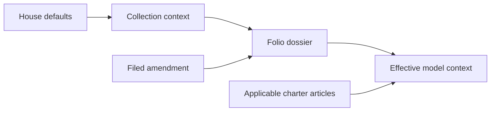

# The House and the fluid desk

The manuscript remains the centre of the workspace. Comments, editorial notes,
sources, books, records and connections to past writing share its margins. The
existing side panels remain available for deliberate browsing.

[Names & inheritance](#names-and-inheritance) · [Margin interactions](#interaction-contract) ·
[Focus & assistance](#focus-and-assistance) · [Storage & sync](#storage-and-sync) ·
[Verification](#verification)

## Names and inheritance

| Name       | Meaning                                                                                                                   |
| ---------- | ------------------------------------------------------------------------------------------------------------------------- |
| House      | The writer's reusable defaults and standards.                                                                             |
| Collection | A series of folios sharing context. A folio belongs to at most one collection.                                            |
| Folio      | One piece of writing, with its own dossier.                                                                               |
| Dossier    | Audience, purpose, form, tone, constraints and supporting material for a piece. `ProjectBrief` is the internal type name. |
| Charter    | Required or preferred standards, scoped to the House, collection or folio.                                                |
| Edition    | A saved version of the dossier.                                                                                           |
| Amendment  | A proposed change prompted by the draft, applied only when the writer files it.                                           |
| Register   | The history of context changes and their provenance.                                                                      |

**Fields inherit; standards accumulate.** Nonempty folio fields override collection fields, which override House fields.
Working titles belong only to folios. Legacy interview stand-ins yield to shared
context; blank fields inherit. Charters accumulate across all applicable scopes.
A later manual edit supersedes an earlier amendment's provenance.

`/house/` exposes the cabinet, the register and developer diagnostics. Links from
the Library, the folio menu and dossier refinement keep the active folio in view.
The context preview shows inherited fields and standards; individual tools add
their own instructions, excerpts and source material. Token counts are estimates.

`loadModelBriefForFolio` creates a read-only effective dossier for review, research,
the editorial room and contextual tools. It never saves inherited values into the
folio. Editing, export and edition history continue to use the original dossier.
House changes refresh active model context; applying an amendment refreshes the
saved dossier too.

### Inspect the context

| In the House | What you can inspect                                                            |
| ------------ | ------------------------------------------------------------------------------- |
| Cabinet      | House defaults, collection membership, folio fields and their layer provenance. |
| Register     | What changed, its source, its previous value and its reason.                    |
| Engine room  | Learned timing, local flow sessions and model decision diagnostics.             |

## Interaction contract

- Hovering or focusing a passage marker reveals its associated margin card and
  connections. Clicking a comment or persona note unfolds its full conversation
  in that margin slot. Suggestions use the same placement service.
- One conversation owns the foreground at a time. Switching preserves separate
  unsent reply drafts for the mounted editor session; reloading does not preserve
  those unsent drafts. Sent replies retain the existing storage behavior.
- On narrow screens or with automatic margin reading disabled, the existing
  anchored card provides the fallback. Ambient dock cards yield to open threads,
  tools and selection actions. Open margin cards adapt to viewport changes.
- Cards follow document scrolling and step around tools and expanded threads.
  Escape closes the active conversation. Selection actions yield while a thread
  or suggestion is open.
- Fallback comment, persona-note and suggestion cards follow their passage too.
  A passive listener on the manuscript scroller and resize/reflow updates share
  one animation frame. Cards without a margin slot tuck below or above the live
  passage; slot conversations keep the existing margin handshake. A passage fully
  outside the visible manuscript closes a fallback card without a pin or draft.
  Pinned notes and unsent drafts stay clamped on screen. Split marks count as
  visible while any fragment remains in view.
- Manual focus remains available. Automatic focus fades workspace chrome without
  collapsing the writer's side panels. Interacting with controls or a conversation
  prevents automatic focus from hiding them. A manual exit overrides automatic
  focus temporarily.

## Focus and assistance

`flow-state.ts` reads typing cadence; `flow-profile.ts` learns pause thresholds and
item preferences locally. Working shows a small selection, settling holds new
items, flow clears ambient cards, and stuck favors one relevant item plus its
connections. `flow-conductor.ts` combines these signals with budgeted Jev calls.
Local connections are candidates, not claims of semantic certainty. Drift checks
propose amendments rather than silently rewriting the dossier.

| Reading  | What the margin does                          |
| -------- | --------------------------------------------- |
| Working  | Offers a small selection of relevant items.   |
| Settling | Keeps existing items and holds new arrivals.  |
| Flow     | Clears ambient cards and holds arrivals.      |
| Stuck    | Favors one relevant item and its connections. |

### Galley slips

Entering `flow` opens a session. Leaving for any other reading closes it; Escape,
reaching for the room, turning focus off, disabling automatic focus, destroying
the editor or changing folios closes it too. A session worth remembering lasts
at least one minute **or** adds forty net words. Shorter runs leave no slip.

The slip records its folio, start and end, time in flow, net document word growth
(never negative), rounded words per minute, distinct items upserted or held while
the page was quiet, newly proposed amendments, and how the run ended: a pause,
reaching, a manual exit, stepping away, or closing the folio. Repeated updates to
the same item count once; an amendment already waiting before flow does not count
as a new proposal. Words written before entering flow do not belong to the slip.

The conductor announces qualifying slips on `twyne:flow-session` and logs them as
focus decisions. The last thirty are saved as plain objects in IndexedDB meta
`flow-sessions`; no Qwik store proxies enter that history. `loadFlowSessions()`
reads it and `FlowController.lastSession()` restores the latest slip for the
current folio after a remount. The House's Engine room lists recent slips by date,
folio, minutes, words, pace, what waited and how the run ended; its JSON export
includes them. Slips and cadence profiles remain on this device.

On a narrow screen the slip starts as a compact receipt; open it to see the
details or file it to clear the corner. A relevant margin card takes priority
over the receipt, and opening a conversation clears ambient dock furniture.
The ink ribbon stays beside the word count as the manuscript scrolls. Its
reading has a text alternative and does not announce changes while you write.

### A way in, and the pneumatic post

While stuck, Jev's unresolved-passage Noul must reach 0.6 before a single **A way
in** item is offered. In the same budgeted request, a Choice selects a short prompt
from fixed options: say it plainly, start with a concrete detail, return to the
audience and purpose, pick up an earlier thread, or leave TK and move on. Code
supplies the wording from templates and the dossier; System One selects rather
than writes prose. The earlier-thread option needs an actual matched echo, and
the card links the best available echo for its passage.

With no client, a local stuck reading can supply the plain-sentence prompt only
after strong churn (at least 0.6) and the writer's learned stuck pause. A configured
client's budget skip or failed judgement does not count as confirmation. Late
answers cannot offer help after the passage or mode changes. Only one way-in item
is live at once; dismissing it keeps it dismissed for that passage during the
mounted conductor session. It leads while stuck and waits, with an explicit
policy reason, in every other reading or at another passage.

`FlowSnapshot.heldKinds` is the pneumatic post's tally: held items by kind, beside
the total `held`. It includes only policy-held items, including a waiting way in;
dismissed items do not count. The margin can name what is waiting without showing
the cards during a quiet run.

Cover lookups can be disabled in review controls. Book titles go to Open Library;
record titles go to MusicBrainz and covers come from the Cover Art Archive.
Cadence profiles stay on this device. Diagnostics may contain draft excerpts,
titles, dossier changes and model decisions: inspect an export before sharing it.

## Storage and sync

`house-store.ts` serializes local edits, verifies IndexedDB writes and emits
`twyne:house-changed`. Each edit advances the whole snapshot's timestamp, including
collection membership changes and withdrawals. House state sync runs on both the
House page and the editor, with a live Convex subscription and reconnect refresh.

House, collections and charter use the newer complete snapshot; this is
last-write-wins, not a per-field collaborative merge. Ledger entries are unioned
by ID. A stale server upload may contribute history but cannot replace a newer
snapshot. Local history retains 500 entries; server history is paginated. Signed-out
writing remains local. The current local House is shared within the browser profile,
as with the existing local folio store.

Ledger acknowledgements are tracked per account in IndexedDB, separately from
the server's bounded history window. An acknowledged entry is not uploaded again
just because it is absent from the latest pull. Partial uploads retry only the
unacknowledged batches; persisting an acknowledgement can retry without repeating
the accepted server mutation.

The margin handshake lives in `margin-surface.ts`: a card reserves a slot before
the editor mounts its full conversation, then receives geometry updates. Pending
reservations survive the old card closing. Editor request tokens prevent slower
opens from replacing a more recently selected conversation.

### Source map

| Contract                           | Implementation                                                                                                              |
| ---------------------------------- | --------------------------------------------------------------------------------------------------------------------------- |
| Context assembly and provenance    | [`house-model.ts`](../src/utils/house-model.ts), [`model-context.ts`](../src/utils/model-context.ts)                        |
| Local persistence and account sync | [`house-store.ts`](../src/utils/house-store.ts), [`house-sync.ts`](../src/utils/house-sync.ts)                              |
| Cadence and learned preferences    | [`flow-state.ts`](../src/utils/flow-state.ts), [`flow-profile.ts`](../src/utils/flow-profile.ts)                            |
| Gathering and surfacing            | [`flow-conductor.ts`](../src/components/editor/extensions/flow-conductor.ts), [`flow-items.ts`](../src/utils/flow-items.ts) |
| Conversation placement             | [`margin-surface.ts`](../src/utils/margin-surface.ts), [`flow-surface.tsx`](../src/components/in-flow/flow-surface.tsx)     |

## Verification

Focused tests cover inheritance, provenance, quiet-mode surfacing, focus overrides,
session qualification and history, teardown/remount, typed way-in selection and
dismissal, held-kind tallies, cadence transitions and learned thresholds, margin
registration, fallback viewport clamping, card collision placement, snapshot
deletion semantics, account isolation and stale uploads. Browser checks exercise
the House cabinet and tabs, comment/note/suggestion switching, separate reply
drafts, Escape, scrolling and mobile resizing.

**Separate integration checks:** a live authenticated two-device sync and a
funded model-generation session. Local browser fixtures and mocked backend tests
do not prove these paths.
