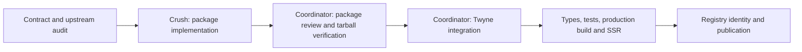

# General Translation for Qwik

Current scope: keep the adapter as a local workspace package. Publication is deferred by the user; retain an independent package structure and documentation for possible later reuse.

Build an independent, publishable `gt-qwik` package in `packages/gt-qwik`, authored by Crush, then consume its packaged output in Twyne. Use the unscoped name `gt-qwik`, matching `gt-react`; verify registry availability and publisher ownership before release. This is an unofficial adapter. Initial compatibility is Twyne's Qwik 2 beta; do not claim Qwik 1 support without testing it.

| Node | Owner and exclusive files                                           | Dependencies | Acceptance gate                                                                               |
| ---- | ------------------------------------------------------------------- | ------------ | --------------------------------------------------------------------------------------------- |
| A    | Coordinator: this plan                                              | None         | Scope, API, packaging and boundaries specified                                                |
| B    | Crush: `packages/gt-qwik/**` only                                   | A            | Independent manifest, source, declarations, documentation, focused tests and build            |
| C    | Coordinator: package review                                         | B            | Actual tarball consumer works; no Twyne source imports or bundled Qwik runtime                |
| D    | Coordinator: Twyne root, i18n config, scripts and representative UI | C            | Uses package exports, serializable locale context and English fallback                        |
| E    | Coordinator: verification                                           | D            | Typecheck, focused tests, production build and SSR smoke pass                                 |
| F    | Coordinator: release                                                | E            | Name and publisher verified; publish exact reviewed artifact when release details are settled |

Execution waves follow the dependency chain. While Crush authors B, the coordinator prepares the app's catalog and integration points without touching package files.

## Package contract

- Qwik provider with serializable per-tree locale/catalog state; explicit initial locale for SSR. Never store active locale in a process-global singleton.
- A translation hook and locale-switching API compatible with Qwik serialization and lazy event handlers. No closures over unserializable runtime instances in component state.
- Use GT message hashing and ICU interpolation, with checked-in catalogs and deterministic English fallback. Isolate any `gt-i18n/internal` imports in one bridge and pin the upstream version if required.
- Prefer a source dictionary with a documented, tested GT CLI extraction path over pretending that the React extractor understands custom Qwik hooks.
- Missing catalogs, unsupported locales, variable interpolation and concurrent SSR locale isolation must be tested. Keep credentials and runtime translation requests out of the browser package.
- Expose locale metadata so applications can update document language/direction and implement selectors. Persistence and HTTP negotiation belong to the consuming application.
- Ship ESM, declarations and Qwik-consumable source/exports as required by the optimizer. Peer-depend on Qwik; do not bundle a second framework runtime. Include README, license, examples, supported-version limits and publication files allowlist.

## Twyne integration

Wire the provider into the root and migrate a representative settings surface to dictionary messages. Catalog configuration is app-owned. English (`en`) is the source and fallback language; French (`fr`) is the first translation. Automatic selection follows the browser/OS preference order, matching regional tags such as `fr-CA` to French. Unsupported preferences fall back to English. Browser language is the available proxy for OS preferences on the web.

The language control belongs only in Settings, with Automatic, English and Français choices. Do not add a floating control, header selector or other global UI. Persist an explicit choice and prioritize it over automatic detection. Automatic must remain a preference distinct from its resolved language. Keep SSR and browser resolution consistent using the stored choice and request Accept-Language where available; handle storage-disabled browsers gracefully. Only advertise catalogs that exist. Document remaining untranslated surfaces and GT credential requirements accurately.

## Ordered verification

1. Package build, typecheck and behavioral tests.
2. Pack and inspect manifest/file list; consume exports from a fresh temporary project.
3. GT CLI dry-run against the source dictionary and verify extracted keys/hash compatibility.
4. Twyne `bun run build.types`, focused translation tests, and `bun run build.client` / SSR build.
5. SSR render with two locales; verify preference order, `fr-CA` matching, English fallback, explicit overrides, Settings language switch and reload.
6. Registry name, publisher and release artifact verification before publication.

Crush must preserve all existing dirty work, must not edit Twyne files or root lockfiles, and must not commit, push, publish, deploy or access credentials. Package authorship is delegated; final integration and release review remain coordinator-owned.
