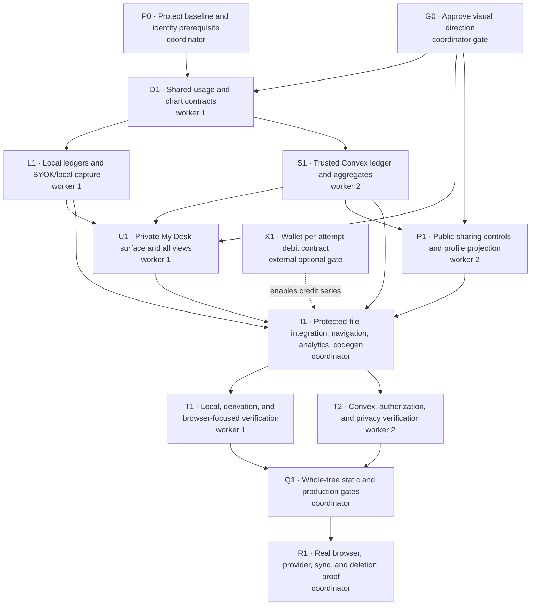

# My Desk: writer profile, usage, and cost

Status: Proposed  
Target: Twyne web application  
Primary route: `/desk`  
Related surfaces: `/settings`, `/<handle>`, editor navigation

## Summary

My Desk is a private, local-first writer profile that helps someone understand
how they use Twyne, what they have made, where AI assisted them, and what that
assistance cost. It should remain useful without an account, become
cross-device when the writer signs in, and expose only explicitly selected
writing statistics on the public profile.

The experience takes inspiration from Keating's usage page: the useful unit is
not an invoice row but an explorable personal history. Twyne should adapt that
idea to writing outcomes:

- days writing, streaks, folios, and published pieces;
- editorial-room actions and the tools or editors consulted;
- provider, model, token, and cost breakdowns;
- recent and unusually deep pieces of work;
- clear control over local data, synchronized data, and public data.

The usage ledger is a product-data source owned by the writer. PostHog remains
an aggregate product-observability system and must not become the profile or
billing source of truth.

## Goals

1. Give signed-out writers a useful private profile using data on the current
   device.
2. Give signed-in writers the same profile across devices without weakening
   the local-first writing path.
3. Explain AI usage and cost at several useful levels: total, over time, by
   feature, by provider/model, and by folio.
4. Distinguish actual charges, estimated provider cost, Twyne credits, and
   local inference so the page never presents an estimate as a bill.
5. Surface interesting, evidence-based writing patterns without inspecting or
   classifying manuscript content.
6. Let writers export and delete their usage history.
7. Reuse the existing public writing profile while keeping private usage and
   cost private by default.

## Non-goals

- Reconstructing complete historical usage from PostHog.
- Showing internal margins, platform-wide rankings, or comparisons with other
  writers.
- Inferring personality, quality, productivity, or writing ability from usage.
- Treating token count, time on page, or AI spend as a measure of good writing.
- Building the Creem credit purchase flow in this feature.
- Storing prompts, completions, manuscript excerpts, folio titles, or API keys
  in the usage ledger.
- Making client-reported BYOK estimates authoritative for billing, credits, or
  entitlement decisions.

## Product principles

### Outcomes before consumption

The top of the page should lead with writing activity and work completed. Token
and cost details are available, but should not dominate the writer's identity.

### Local-first means useful while signed out

The dashboard must not require authentication. Signed-out usage is stored in
IndexedDB and labeled "Saved on this device." Signing in may synchronize that
history, but a network failure must not make the local dashboard disappear.

### Cost language must be exact

The UI uses four cost states:

| State     | Meaning                                                         | Display treatment         |
| --------- | --------------------------------------------------------------- | ------------------------- |
| Actual    | A trusted hosted provider or wallet returned the charged amount | "Actual hosted cost"      |
| Estimated | Cost calculated from reported tokens and a versioned price      | "Estimated provider cost" |
| Local     | Inference ran locally and incurred no provider charge           | "No provider charge"      |
| Unknown   | Usage or pricing was insufficient for a defensible estimate     | "Cost unavailable"        |

`unknown` must never be silently converted to zero. Twyne credits used and
provider cost are separate values and are never added into one ambiguous
"spend" number.

### Private by default

Usage, cost, providers, models, private folio identifiers, and inferred writing
patterns are private. Public profile additions require explicit, reversible
opt-in per statistic.

### Metadata, not manuscript content

All derived insights come from content-free metadata. "Most consulted editor"
is valid because it counts editor actions. "Your writing is becoming more
literary" is not valid because it interprets private prose.

## Information architecture

### Route and navigation

Add a reserved static route at `/desk`, linked as **My Desk** from the primary
application navigation and the signed-in account panel. The public profile
continues to live at `/<handle>`.

The first release is one responsive page with anchored sections rather than a
set of nested routes:

1. Profile header
2. At a glance
3. Writing activity
4. Usage and cost
5. Your patterns
6. Recent work
7. Data and privacy

The URL may use `?range=7d|30d|90d|all` and
`?section=overview|usage|patterns|data` so links remain shareable within the
writer's own browser. These parameters must not contain a folio identifier.

### Profile header

Signed-in header:

- avatar, display name, and `@handle` when configured;
- "Synced across devices" plus last successful sync time;
- link to edit identity and public-profile settings;
- link to view the public profile.

Signed-out header:

- generic "Your writing desk" identity;
- "Saved on this device" status;
- optional sign-in call to action explaining that sign-in adds cross-device
  history without blocking local use.

### At a glance

Show four primary cards:

- **Days writing** — distinct active days in the selected range;
- **On the desk** — current folio count and current total words, not a claim
  about lifetime words written;
- **Editorial actions** — completed AI-assisted actions in the range;
- **AI cost** — actual and estimated values separated in the detail text.

Secondary facts may include published pieces, current streak, longest streak,
and the date tracking began. Empty cards explain which action will populate
them.

### Writing activity

Reuse the existing paper-themed contribution heatmap. On the private page,
active cells are interactive:

- selecting a day shows the folios worked on that day;
- each folio row shows content-free activity counts and links back to it;
- a year selector is shown only when multiple years exist;
- keyboard focus, accessible labels, and a non-color count are required.

The private heatmap may show more detail than the public heatmap. It must not
use `Date.now()` inside a Convex query; the client passes range boundaries.

### Usage and cost

Provide a segmented range control for 7 days, 30 days, 90 days, and all time.

Summary:

- completed and failed generations;
- input, output, cache-read, cache-write, and reasoning tokens when reported;
- actual hosted cost;
- estimated BYOK/hosted provider cost;
- Twyne credits used, once the wallet supplies an authoritative debit;
- local generations with no provider charge;
- generations whose cost could not be calculated.

Breakdowns:

- by writing feature, using reader-facing names such as Room feedback,
  Rewrites, Rubric review, Apparatus research, and Dossier interview;
- by provider and model;
- by folio, showing a local/private title only after joining the usage row to
  the local folio store in the browser;
- over time, as daily cost and action count.

Every cost panel includes a short explanation of whether amounts are actual or
estimated, the pricing date/version, and a link to the detailed methodology.
Amounts below one cent render as `<$0.01` or with up to four decimal places
rather than as `$0.00`.

### Your patterns

Patterns are deterministic summaries over metadata, with a visible evidence
label. Initial candidates:

- current and longest writing streak;
- most active weekday;
- most consulted editorial persona;
- most-used writing tool;
- most revised folio, based on revision/action count rather than a quality
  judgment;
- deepest room session, based on recorded editorial turns;
- number of distinct editors consulted;
- proportion of AI actions by feature;
- average actual/estimated AI cost per active folio.

Do not show a pattern until its minimum evidence threshold is met. Use plain
fallback copy such as "Keep writing and this pattern will appear" rather than
making a claim from one event.

### Recent work

List recently active folios with:

- private title resolved locally;
- last active date;
- current word count;
- days active in the selected range;
- editorial actions;
- actual and estimated cost shown separately;
- a direct "Open folio" action.

The server ledger stores only `folioId`; titles are joined in the browser from
the writer's authorized local/synchronized folio data.

### Data and privacy

Provide:

- export usage as JSON;
- export a human-readable CSV of generation metadata;
- clear local usage history;
- delete synchronized usage history;
- a coverage note showing the date reliable usage tracking began;
- public-profile sharing controls;
- a concise list of fields stored in the ledger;
- an explicit statement that prompts and manuscript text are excluded.

Deletion is separate from ordinary folio deletion. Account deletion must also
delete all synchronized usage and aggregate rows.

## Public profile

The existing `/<handle>` profile remains publication-first. Add optional
toggles in Settings for:

- show writing heatmap;
- show days written in the last 30 days;
- show current or longest streak;
- show number of public pieces;
- show number of folios on the desk.

Defaults:

- existing public behavior remains unchanged for existing profiles;
- newly introduced statistics default off except statistics already public;
- cost, tokens, provider/model, AI actions, private folio titles, and private
  patterns are never eligible for public sharing in the first release.

Public queries must continue to return the same missing-profile shape used to
avoid user enumeration.

## Measurement semantics

### Writing activity

- An active day is a UTC day with at least one throttled writing-activity
  record. Display grouping may use the browser's locale, but storage remains
  UTC and the UI explains the boundary when needed.
- A streak is a sequence of active UTC days ending today or yesterday.
- "Current words" is calculated from the latest accessible folio contents.
- Do not claim historical "words written" until an append-only word-count
  delta source exists; current word count is not the same metric.

### Editorial actions

- Count one logical user-requested action, not every retry or every persona
  generation, for the headline total.
- Preserve generation-level rows for token and cost accounting.
- `editorialActionId` groups retries and multi-persona generations into the
  logical action.
- A retry updates or supplements the existing logical action; it does not
  create duplicate cost rows when the provider did not charge twice.

### Cost

All stored monetary values use integer micro-USD (`1 USD = 1,000,000
micro-USD`). Code must reject negative, fractional, non-finite, and unsafe
integer values at write boundaries.

Cost priority:

1. authoritative provider or wallet debit;
2. provider-reported generation cost;
3. versioned token-price calculation;
4. unknown.

The pricing calculation stores:

- pricing source;
- pricing version or effective date;
- input, output, cache, and reasoning rates used;
- currency;
- whether the result is actual or estimated.

Price changes never rewrite historical rows. A corrected pricing catalog may
run an explicit, versioned recalculation migration, preserving the original
estimate and marking the replacement.

## Data architecture

### Existing boundaries to preserve

- IndexedDB remains the source of truth while a writer is using the browser.
- Convex is the cross-session/cross-device source for authenticated writers.
- Signed-out writers never need Convex.
- PostHog and Arize receive privacy-safe observability projections, not the
  source usage ledger.
- Authenticated ownership uses `identity.tokenIdentifier`, derived inside
  Convex. No public function accepts a caller-supplied owner ID.

### Canonical usage event

Use a shared domain shape for local and synchronized records:

```ts
interface UsageEvent {
  eventKey: string;
  occurredAt: number;
  day: string;
  source: "hosted" | "byok" | "local";
  authority: "server" | "provider" | "client_reported";
  feature: AiFeature;
  provider: string;
  model: string;
  folioId?: string;
  editorialActionId?: string;
  traceId: string;
  attempt: number;
  outcome: "completed" | "failed";
  inputTokens?: number;
  outputTokens?: number;
  cacheReadTokens?: number;
  cacheWriteTokens?: number;
  reasoningTokens?: number;
  totalTokens?: number;
  costMicrousd?: number;
  costKind: "actual" | "estimated" | "local" | "unknown";
  pricingVersion?: string;
  creditMicrounits?: number;
}
```

`eventKey` is stable and unique for a billable provider attempt. Prefer a
provider request ID when it is available; otherwise derive it from the trace,
attempt, provider, and model. `traceId` alone is insufficient because a real
retry may incur another charge.

The shape contains no prompt, response, manuscript excerpt, title, handle,
email, API key, or error message.

### Local storage

Add an IndexedDB usage-event store behind a small repository interface:

- `putUsageEvent` is idempotent by `eventKey`;
- `listUsageEvents({ from, to, cursor, limit })` is bounded;
- `summarizeLocalUsage({ from, to })` streams or pages rather than loading an
  unbounded history into memory;
- `deleteUsageHistory` is explicit;
- `exportUsageHistory` returns the content-free canonical shape.

Client/BYOK generation paths write the event only after usage metadata settles.
Failed attempts are recorded only when the provider request was actually sent.
Local inference records `costKind: "local"` and does not invent token counts
that the local runtime did not report.

### Convex storage

Proposed tables:

1. `aiUsageEvents` — append-only generation-level ledger, idempotent by owner
   and event key;
2. `aiUsageDailyTotals` — one aggregate row per owner/day;
3. `aiUsageDailyBreakdowns` — bounded rows per owner/day/dimension/key;
4. `aiUsageLifetimeTotals` — one aggregate row per owner;
5. `aiUsageLifetimeBreakdowns` — one row per owner/dimension/key.

Required indexes include every indexed field in the index name:

- `aiUsageEvents.by_ownerId_and_eventKey`;
- `aiUsageEvents.by_ownerId_and_occurredAt`;
- `aiUsageDailyTotals.by_ownerId_and_day`;
- `aiUsageDailyBreakdowns.by_ownerId_and_dimension_and_day`;
- `aiUsageDailyBreakdowns.by_ownerId_and_day_and_dimension_and_key`;
- `aiUsageLifetimeBreakdowns.by_ownerId_and_dimension_and_key`.

Do not store an ever-growing array of events or model keys in a profile or
daily-total document.

The trusted recording mutation inserts the event and updates every affected
daily/lifetime aggregate in the same transaction. A duplicate `eventKey` is a
successful no-op. Aggregate rows must never be updated from a separate best-
effort transaction because the ledger and totals could drift.

If aggregate maintenance becomes complex enough to justify
`@convex-dev/aggregate`, its update must remain in the same mutation as the
source event.

### Trusted and client-reported writes

Hosted/server generation:

- the Convex action already has authenticated identity and provider usage;
- it invokes an internal mutation after the provider attempt settles;
- owner ID comes from `identity.tokenIdentifier`;
- these events may be `server`, `provider`, actual, or estimated;
- only this path may affect credits, entitlements, or authoritative hosted
  totals.

BYOK/browser generation:

- the browser writes the event locally first;
- after sign-in it may upload a content-free event through a public mutation;
- the mutation derives owner ID from auth and validates every numeric/string
  bound;
- synchronized events remain `client_reported` and estimated/unknown;
- client-reported rows never affect credits, entitlements, invoices, or abuse
  limits.

Local inference:

- remains local by default;
- may sync as `client_reported` only if the writer enables usage-history sync;
- always renders as no provider charge, never as authoritative zero-dollar
  billing.

### Read APIs

Public-to-the-authenticated-client queries:

- `usage.getMySummary({ from, to, now })` — bounded daily totals plus lifetime
  totals for `all`;
- `usage.getMyBreakdown({ from, to, dimension, paginationOpts })` — paginated
  feature/provider-model/folio breakdown;
- `usage.listMyRecent({ paginationOpts })` — paginated raw content-free events;
- `usage.getMyCoverage()` — first reliable event, last event, and unknown-cost
  counts;
- `usage.getPublicStats({ handle, now })` — only fields enabled by the profile
  owner.

All queries derive identity server-side, use indexes, and either `.take(n)` or
Convex pagination. No growing table query uses an unbounded `.collect()`. Time
boundaries are arguments supplied by the client; queries do not read the wall
clock.

### Synchronization

On the first authenticated load after sign-in:

1. Load local events in bounded pages.
2. Upload content-free, client-reported events in bounded batches.
3. Deduplicate by `(ownerId, eventKey)`.
4. Mark each local event with the synchronized account identifier only after
   the server acknowledges it.
5. Keep local events after synchronization so the dashboard remains available
   offline.

Account switching must not upload one person's previously synchronized events
to another account. Unsynchronized device-local events require an explicit
choice if the browser has previously been associated with a different account.

The folio snapshot sync and usage-event sync remain separate protocols. Usage
sync is append-only/idempotent and must not be added to the four-second draft
snapshot.

## Pricing service

Create a pure, versioned pricing module shared by client and server where
possible. It accepts normalized usage plus a provider/model key and returns one
of `estimated`, `local`, or `unknown`.

Requirements:

- exact model matching before aliases;
- separate input, output, cache-read, cache-write, and reasoning rates;
- integer-safe micro-USD arithmetic with rounding specified in tests;
- catalog version stored on every estimate;
- unknown model means unknown cost, not zero;
- no network lookup on the critical generation path;
- catalog updates reviewed like code or fetched into a pinned, validated
  snapshot outside the generation transaction.

The page's methodology disclosure lists the active catalog version and warns
that BYOK provider invoices may differ because of provider-side rounding,
batching, discounts, or cache policy.

## Derived profile calculations

Implement deterministic pure functions with explicit minimum evidence:

| Insight                       | Evidence                                  | Minimum           |
| ----------------------------- | ----------------------------------------- | ----------------- |
| Current streak                | Distinct active days                      | 1 day             |
| Longest streak                | Distinct active days                      | 2 days            |
| Most active weekday           | Active-day counts                         | 5 active days     |
| Most consulted editor         | Persona generation/action counts          | 5 actions         |
| Most-used tool                | Feature counts                            | 5 actions         |
| Most revised folio            | Revision/action counts by folio           | 2 eligible folios |
| Deepest room session          | Editorial turns grouped by action/session | 2 sessions        |
| Average cost per active folio | Known costs and active folios             | 2 folios          |

Every insight returns its evidence count and range so the UI can explain the
claim. Ties use a stable rule and may render as a shared result rather than an
arbitrary winner.

## PostHog instrumentation

Capture product interaction with the profile, not the private measurements:

- `desk_viewed` with signed-in state and selected range;
- `desk_section_opened` with section name;
- `usage_range_changed` with range;
- `usage_exported` with format and row-count bucket;
- `usage_history_deleted` with local/synchronized scope;
- `public_profile_stats_updated` with enabled-stat count.

Never send dollar amounts, token totals, folio IDs/titles, model API keys,
private pattern values, or exported content in these events. Existing
`$ai_generation` observability remains separate.

## Empty, partial, and error states

- No writing: explain that the profile fills in as the writer works and offer
  "Start a folio."
- Writing but no AI: show writing history normally and state "No AI usage in
  this range."
- Tokens but unknown cost: show tokens and "Pricing unavailable for this
  model."
- Partial historical coverage: show "AI usage tracked since [date]" near every
  all-time total.
- Offline while signed in: render local data and mark synchronized totals as
  last updated at the last acknowledged time.
- Sync conflict/account switch: preserve local data and request a destination
  decision; never silently attach it to the new account.
- Aggregate truncation: return and render an explicit partial-results flag.

## Historical data and migration

Do not backfill personal ledgers from PostHog. Historical identity linking is
incomplete, estimates may have been computed with a different pricing catalog,
and product analytics is not the writer-owned source of truth.

Safe initial backfill:

- existing local folio count and current word count;
- existing `writingActivity` days for authenticated writers;
- existing published-piece counts;
- existing persona-note counts where the owner can access the notes.

AI token and cost history begins when the canonical usage ledger ships. The UI
states this date. An administrative, audited migration may be designed later,
but is not part of launch.

## Security and privacy requirements

- Every Convex read and write derives `ownerId` from
  `ctx.auth.getUserIdentity().tokenIdentifier`.
- No client argument is accepted as ownership evidence.
- Hosted ledger writes are internal mutations invoked from authenticated
  actions.
- Client-reported rows are permanently marked and excluded from financial
  authority.
- String fields have length limits; numeric fields require finite,
  non-negative, integer-safe validation beyond Convex's structural validators.
- Event keys are namespaced by owner and cannot overwrite another owner.
- Export contains no content and warns that provider/model history may still
  be sensitive.
- Account deletion removes raw usage, daily totals, lifetime totals,
  breakdowns, and public sharing preferences in bounded scheduled batches.
- Public profile queries return only opted-in aggregate fields.
- Error messages, prompts, outputs, manuscript text, titles, and API keys never
  enter the ledger.

## Performance requirements

- `/desk` reaches first meaningful local render without waiting for Convex.
- Local aggregation runs off the main thread or in bounded chunks when history
  is large.
- Range queries read daily aggregates, not all raw generation events.
- Recent-event lists are paginated.
- Breakdown queries are paginated and expose truncation.
- Aggregate writes are idempotent and transactional.
- Dashboard subscriptions are scoped to the current authenticated writer.
- The default 30-day view should require a bounded number of indexed documents
  independent of lifetime event count.

## Accessibility

- Every chart has an equivalent text/table view.
- Heatmap cells with activity are keyboard selectable and have date/count
  labels.
- Cost state is communicated with text, not color alone.
- Range controls use buttons or tabs with visible selected state.
- Reduced-motion preferences are respected.
- Compact monetary values have full values in accessible labels/tooltips.

## Implementation plan

### Phase 0 — identity prerequisite

- Align browser and server PostHog identity on the canonical authenticated
  token identifier.
- Verify sign-in, sign-up, session restore, account switching, and logout.
- This phase improves analysis but does not make PostHog a usage ledger.

### Phase 1 — domain contract and local ledger

- Add the canonical usage event type, numeric validation, cost-state helpers,
  and versioned pricing module.
- Add the IndexedDB usage repository and migrations.
- Record BYOK and local generation usage at the shared AI client boundary.
- Add pure summary, streak, breakdown, and pattern derivations.
- Add JSON/CSV export.

### Phase 2 — trusted hosted ledger

- Add Convex schema tables and indexes.
- Add internal hosted-usage recording and transactional aggregates.
- Record usage at every hosted generation boundary, including failures and
  retries.
- Add authenticated, bounded summary and breakdown queries.
- Add client-reported batch sync with strict validation and idempotency.
- Extend account deletion to all usage tables.

### Phase 3 — My Desk UI

- Add `/desk`, navigation, profile header, range state, and local-first load.
- Add metric cards, heatmap drill-down, cost breakdowns, patterns, and recent
  work.
- Join folio IDs to private titles only in the authorized browser.
- Add empty, offline, partial-coverage, and unknown-cost states.
- Add interaction analytics through the product event allowlist.

### Phase 4 — public controls

- Add per-stat sharing preferences to the profile.
- Extend the public profile query and page with only opted-in aggregates.
- Verify no private usage or folio metadata appears in public responses, page
  source, analytics, or metadata tags.

### Phase 5 — reconciliation and release

- Compare a controlled set of provider responses, ledger rows, PostHog events,
  and visible totals.
- Exercise retry, partial usage, unknown pricing, offline, account switch,
  import, export, deletion, and public visibility.
- If credits are enabled, prove checkout to entitlement to usage debit to
  receipt/dashboard reconciliation as a separate launch gate.

## Proposed file ownership

Likely new files:

- `src/routes/desk/index.tsx`
- `src/components/desk/desk-summary.tsx`
- `src/components/desk/writing-activity.tsx`
- `src/components/desk/usage-cost.tsx`
- `src/components/desk/writer-patterns.tsx`
- `src/components/desk/recent-work.tsx`
- `src/components/desk/data-controls.tsx`
- `src/utils/usage-ledger.ts`
- `src/utils/usage-pricing.ts`
- `src/utils/usage-summary.ts`
- `src/utils/usage-export.ts`
- `convex/usage.ts`

Likely modified files:

- `convex/schema.ts`
- hosted generation actions in `convex/agents.ts` and related action modules;
- `src/utils/ai-client.ts` and `src/utils/idb.ts`;
- `src/utils/product-analytics.ts`;
- navigation/account components;
- `src/routes/settings/index.tsx`;
- `src/routes/[handle]/index.tsx`;
- `convex/writingActivity.ts`, `convex/profiles.ts`, and account-deletion code.

Convex implementation work must first re-read
`convex/_generated/ai/guidelines.md` and keep all functions under `convex/`.

## Test plan

### Pure/unit tests

- usage normalization with missing and provider-specific fields;
- integer micro-USD rounding at rate boundaries;
- actual/estimated/local/unknown precedence;
- stable event keys and retry attempts;
- idempotent duplicate inserts;
- range boundaries and timezone display;
- current/longest streaks with gaps;
- deterministic ties and minimum evidence for patterns;
- CSV/JSON export excludes prohibited fields;
- folio title joins never enter synchronized rows.

### Convex tests

- unauthenticated reads and writes fail;
- caller cannot select or impersonate an owner;
- duplicate event keys do not double-count aggregates;
- one insert updates raw, daily, lifetime, and breakdown rows atomically;
- failed aggregate update rolls back the raw insert;
- client-reported events cannot affect credits or authoritative totals;
- summary and breakdown queries are indexed and bounded;
- account deletion removes every usage row in bounded batches;
- public query returns only opted-in fields and preserves missing-handle
  behavior.

### Browser tests

- signed-out local dashboard survives reload and works offline;
- sign-in synchronizes eligible local events exactly once;
- account switching does not leak or reassign history;
- signed-in offline mode still renders local data;
- selected range updates every section consistently;
- heatmap and charts are keyboard usable with table alternatives;
- `<$0.01`, unknown cost, and local inference are visually distinct;
- export and deletion confirmations work;
- public toggles change only the public profile.

### Live verification

- one BYOK request with known token usage;
- one hosted request with authoritative or estimated cost;
- one local request;
- one provider error before usage and one after usage;
- one genuine charged retry;
- compare provider response, stored event, aggregate, profile display, and
  privacy-safe PostHog projection;
- verify account deletion and public profile behavior against the deployed
  Convex environment.

## Acceptance criteria

The feature is ready when:

1. A signed-out writer can open `/desk` and understand local writing activity
   and AI usage without creating an account.
2. A signed-in writer sees synchronized data across two browsers and retains an
   offline local view.
3. Every hosted generation is represented at most once per charged attempt and
   daily/lifetime totals reconcile with raw rows.
4. Actual, estimated, local, and unknown costs are never conflated.
5. The dashboard explains the reliable tracking start date.
6. Range, feature, model/provider, and folio totals reconcile for the same
   selected period.
7. No prompt, response, manuscript content, private title, API key, or raw
   error message is stored in the ledger or sent through profile analytics.
8. Client-reported data cannot change credits, entitlements, invoices, or
   authoritative hosted totals.
9. All growing Convex reads are indexed and bounded or paginated.
10. Writers can export and delete local and synchronized history.
11. The public profile reveals only statistics explicitly enabled by its
    owner, and never reveals cost or private AI usage.
12. Targeted unit, Convex, browser, typecheck, lint, and build checks pass, with
    live provider/deployment verification reported separately.

## Launch decisions

These defaults make the implementation graph below decision-complete. Changing
one is a product decision and requires updating the affected node before work
starts.

1. **Device history requires confirmation.** On first sign-in, show "Add this
   device's history" before uploading unsynchronized local usage. Remember the
   acknowledged account on each local row. Account switching never silently
   reassigns rows.
2. **Raw synchronized events remain until writer deletion.** Reads are still
   paginated and aggregates remain bounded. Retention can later become a
   separate policy migration; the first release does not silently expire a
   writer's exportable history.
3. **Pricing is a code-reviewed, pinned catalog.** Version one is generated
   from official provider pricing documentation, checked on the implementation
   date, committed as data beside the pure pricing module, and identified by an
   effective-date version. Updating it is an ordinary reviewed code change,
   not a network request on the generation path.
4. **Credits are a separate non-currency unit.** `creditMicrounits` never shares
   an axis or total with micro-USD. Until the wallet returns an authoritative
   per-attempt debit, My Desk says that credit usage is unavailable rather than
   deriving it from cost.
5. **Existing public heatmap behavior is preserved.** An absent sharing
   preference means heatmap-visible only for profiles that predate the new
   preference. New handles initialize all newly introduced statistics off.
   The rollout records an explicit preference for existing handles so this is
   not a permanent date-dependent branch.
6. **All-time is total-only at launch.** The page offers full breakdowns for
   7, 30, and 90 days. "All" shows lifetime totals and coverage, while its
   breakdown panels explain that a bounded range must be selected. This keeps
   the first version independent of lifetime key cardinality.
7. **Local inference remains local by default.** It can synchronize only after
   the writer enables usage-history sync, and remains permanently
   `client_reported` with `costKind: "local"`.
8. **Detailed writing activity begins at the new local ledger.** Existing
   `writingActivity` rows can backfill day totals for authenticated writers but
   contain no `folioId`. They populate the heatmap with a partial-coverage
   marker; folio drilldown starts when the new content-free per-folio activity
   rows ship.

## Approved visual direction

The writer approved the distilled Direction B, the visibly printed **Desk
Dossier**, on 2026-08-26. The north-star reference is
[`docs/assets/my-desk-direction-b-distilled.png`](./assets/my-desk-direction-b-distilled.png).
The original, denser exploration remains available as
[`docs/assets/my-desk-direction-b.png`](./assets/my-desk-direction-b.png).

Carry into code:

- the asymmetric dossier grid, dominant writing-activity field, right-hand
  facts/provenance rail, ruled sections, halftone keys, and editorial type
  hierarchy;
- Direction A's prominent selected-day AI drilldown and clearer separation of
  actual and estimated cost;
- one lower analytical view at a time behind Cost, Features, Models, and Tokens
  tabs, with patterns and recent work reduced to quiet summary rows;
- semantic theme inheritance for every background, ink, rule, action, and
  chart-series color, including Foolscap, Broadsheet, Nightpress, and writer
  overrides.

Do not literalize the mock's sample identity, providers, monetary values,
content-derived pattern claims, donut charts, or fixed colors. Production uses
real content-free data, deterministic metadata-only patterns, reconcilable
chart forms with table alternatives, and existing Twyne design tokens. All
visible ingredients are implemented with semantic Qwik, CSS, and SVG; the mock
itself is documentation, not a raster UI asset.

## Graph and view contract

Every view reads the same normalized range result and exposes an equivalent
text/table representation. Selecting a day, feature, provider/model, or folio
filters or explains downstream detail without changing the underlying totals.
All categorical views use stable descending sort with a lexical tie-break and
an explicit "Other" row only when truncation is reported.

| View                               | Data and visual contract                                                                                                                                                                                 | Interaction and reconciliation gate                                                                                                                                                                                |
| ---------------------------------- | -------------------------------------------------------------------------------------------------------------------------------------------------------------------------------------------------------- | ------------------------------------------------------------------------------------------------------------------------------------------------------------------------------------------------------------------ |
| Writing heatmap and day drilldown  | UTC day cells from content-free writing-activity totals; selected day expands per-folio activity counts and links. Legacy days without detail remain visibly partial.                                    | Client supplies `now`, range, and display timezone. Keyboard selection, accessible date/count labels, year selector when needed, and a tabular day list are mandatory. Selected-day totals equal the heatmap cell. |
| Daily activity/actions             | Daily writing activity plus completed and failed logical editorial actions. Retries remain generation rows but are grouped by `editorialActionId` for the action series.                                 | Shared range cursor drives both series. The accessible table includes date, writing count, completed actions, and failed actions. Summed action rows equal the headline action total.                              |
| Daily actual-versus-estimated cost | Two separate daily series: authoritative actual micro-USD and estimated micro-USD. Local and unknown generations are annotated counts, never plotted as zero-cost dollars.                               | Legend and labels state authority in text. Each series sum equals its corresponding cost card; days below one cent retain full accessible values.                                                                  |
| Feature breakdown                  | Ranked bars/table for reader-facing feature names, with logical actions, generations, tokens, actual cost, and estimated cost available as explicit measures.                                            | Changing measure never changes category membership. Sum plus explicit truncated/Other amount reconciles with the same range total.                                                                                 |
| Provider/model breakdown           | Hierarchical provider rows with model children; exact model keys precede aliases.                                                                                                                        | Expand/collapse is keyboard operable. Provider totals equal their model children and the grand total reconciles with the selected measure. Unknown provider/model remains an explicit bucket.                      |
| Folio breakdown                    | Private ranked bars/table by opaque `folioId`, joined to local or authorized synchronized titles only in the browser. Missing/deleted folios render "Unavailable folio," never a leaked or cached title. | Direct "Open folio" action is present only for an authorized local folio. Sum reconciles to the selected range; no title crosses the ledger, Convex, export, or analytics boundary.                                |
| Token dimensions                   | Stacked composition plus table for input, output, cache read, cache write, and reasoning tokens; reported total is displayed separately and discrepancies are flagged rather than rewritten.             | Missing dimensions render unknown, not zero. Dimension sums reconcile only where provider semantics permit; the table explains reported-total differences.                                                         |
| Streak and pattern evidence        | Current/longest-streak timeline plus evidence cards for weekday, editor, tool, revised folio, deepest room session, editor diversity, feature share, and average known cost per active folio.            | Each card shows evidence count, range, threshold, tie result, and why it is or is not shown. No claim appears below its minimum evidence.                                                                          |
| Recent work                        | Reverse-chronological folio timeline/ranked list with last active date, current words, active days, logical actions, and separate actual/estimated cost.                                                 | Private titles are browser joins; table view and "Open folio" are required. Ordering is deterministic and the list is paginated or explicitly capped with a continuation action.                                   |

### Writing-activity detail contract

The current `writingActivity` table is one aggregate row per signed-in
user/day, and the current heatmap cannot determine which folios contributed.
Add a separate content-free detail shape locally and, after consent, in Convex:

```ts
interface WritingActivityDetail {
  activityKey: string; // UTC day plus opaque folio id
  day: string;
  folioId: string;
  count: number;
  firstOccurredAt: number;
  lastOccurredAt: number;
  synchronizedAccountId?: string;
}
```

The browser upserts a throttled row on writing persistence for signed-in and
signed-out writers. The synchronized table is keyed by owner/day/folio, derives
owner from auth, and contains no title, words, excerpts, or editing content.
The existing aggregate `writingActivity` table remains the public heatmap
source until the sharing-preference migration is complete. Private queries may
merge legacy aggregate totals with new detail rows but must expose when a day's
folio breakdown is incomplete.

## Build execution DAG

The graph uses at most two implementation workers plus the coordinator. A
worker may start its next node only after the coordinator accepts the previous
node's patch. Workers are not alone in the repository: each must preserve
pre-existing changes, stay inside its exclusive write set, and never revert or
format unrelated files.



## Execution waves

| Wave |                     Active slots | Ready nodes               | Exit gate                                                                                                                                                   |
| ---- | -------------------------------: | ------------------------- | ----------------------------------------------------------------------------------------------------------------------------------------------------------- |
| 0    |                 Coordinator only | `G0`, `P0`                | User-approved visual reference recorded; dirty/protected baseline and identity-test status recorded; no implementation patch started.                       |
| 1    | Worker 1 plus coordinator review | `D1`                      | One content-free domain contract drives local, server, chart, export, and test fixtures; pricing and range semantics are deterministic.                     |
| 2    |     Two workers plus coordinator | `L1` and `S1` in parallel | Local and trusted server paths independently pass focused tests; no ownership overlap; generation attempts and logical actions are distinguishable.         |
| 3    |     Two workers plus coordinator | `U1` and `P1` in parallel | Every view in the graph contract exists with table alternative and complete empty/error/partial states; public projection exposes opted-in aggregates only. |
| 4    |                 Coordinator only | `I1`                      | Protected changes are reconciled, navigation and root sync are wired, generated Convex API is refreshed, and no worker patch overwrote baseline work.       |
| 5    |     Two workers plus coordinator | `T1` and `T2` in parallel | Focused local/UI and Convex/security suites pass from the integrated tree.                                                                                  |
| 6    |                 Coordinator only | `Q1`                      | Typecheck, lint, formatting, full tests, codegen consistency, and production build pass or are reported precisely.                                          |
| 7    |                 Coordinator only | `R1`                      | Browser and controlled live-provider matrix reconciles stored rows, visible totals, privacy-safe analytics, cross-device sync, export, and deletion.        |

## Agent contracts and exclusive ownership

### G0 — Approve visual direction

- **Role:** coordinator.
- **Depends on:** the Impeccable craft exploration and user response.
- **Owns:** the selected design reference and this plan only; no application
  files.
- **Produces:** an explicit selected direction plus adjustments for information
  hierarchy, graph grammar, density, cost states, mobile layout, and reduced
  motion.
- **Must not do:** infer approval from the existence of a mock or begin backend
  work while the gate remains open.
- **Acceptance:** the user has selected a direction and the coordinator can
  state which reference all UI acceptance checks use.

### P0 — Protect baseline and prove identity prerequisite

- **Role:** coordinator.
- **Depends on:** none; runs alongside `G0` without mutating product code.
- **Owns:** baseline record and integration decisions.
- **Produces:** `git status` snapshot, current test baseline, and confirmation
  that browser and server analytics use the canonical authenticated token
  identifier across sign-up, sign-in, restore, account switch, and logout.
- **Protected existing edits:** `devenv.lock`, `devenv.nix`,
  `src/components/auth/auth-panel.tsx`, `src/utils/auth-context.tsx`,
  `src/routes/oauth-client-metadata.json/index.ts`,
  `src/routes/oauth-client-metadata.json/index.test.ts`,
  `src/utils/posthog-context.tsx`, `src/utils/product-analytics.ts`,
  `src/utils/product-analytics.test.ts`, `src/utils/analytics-version.ts`,
  `src/utils/auth-analytics.ts`, and `src/utils/auth-analytics.test.ts`.
- **Acceptance:** existing changes are understood and their focused tests pass;
  if identity work is incomplete, `I1` remains blocked without blocking design
  review.

### D1 — Shared usage and chart contracts

- **Role:** worker 1.
- **Depends on:** `G0`, `P0`.
- **Exclusive ownership:** new `src/utils/usage-domain.ts`,
  `src/utils/usage-domain.test.ts`, `src/utils/usage-pricing.ts`,
  `src/utils/usage-pricing.test.ts`, `src/utils/usage-summary.ts`,
  `src/utils/usage-summary.test.ts`, `src/utils/usage-export.ts`, and
  `src/utils/usage-export.test.ts`.
- **Produces:** canonical usage/writing-activity validators, stable event keys,
  range/day semantics, integer micro-USD pricing, all chart-series derivations,
  pattern evidence results, reconciliation helpers, and content-free JSON/CSV.
- **Must not edit:** `convex/**`, routes/components, analytics/auth files,
  navigation, IndexedDB, or generated files.
- **Acceptance:** fixtures cover all token dimensions, actual/estimated/local/
  unknown precedence, a charged retry, logical-action grouping, UTC boundaries,
  deterministic ties, minimum evidence, truncation, and prohibited export
  fields. Every graph-contract row has a typed derivation result.

### L1 — Local ledgers and BYOK/local capture

- **Role:** worker 1.
- **Depends on:** accepted `D1`.
- **Exclusive ownership:** `src/utils/idb.ts`, new
  `src/utils/usage-ledger.ts`, `src/utils/usage-ledger.test.ts`,
  `src/utils/usage-sync.ts`, `src/utils/usage-sync.test.ts`, relevant focused
  `src/utils/idb-usage.test.ts`, `src/utils/ai-client.ts`,
  `src/utils/ai-client.test.ts`, `src/utils/ai-client-browser.test.ts`,
  `src/utils/ai-client-reasoning.test.ts`, `src/utils/browser-inference.ts`, and
  a new `src/utils/browser-inference-usage.test.ts`.
- **Produces:** additive IndexedDB migration for `ai-usage-events` and
  `writing-activity-detail`; idempotent bounded repositories; explicit account
  consent/sync markers; BYOK and local generation capture after usage settles;
  throttled signed-out writing activity; export and local deletion.
- **Must not edit:** `src/utils/convex-sync.ts` or add usage events to its
  four-second folio snapshot; `convex/**`; UI/routes; protected analytics/auth
  files; generated files.
- **Acceptance:** reload/offline tests preserve local rows; duplicate event keys
  are no-ops; a genuine retry creates a second attempt; pre-send failures create
  no cost row; post-send failures do; account switching requires an explicit
  destination; local inference never invents tokens or provider cost.

### S1 — Trusted Convex ledger and aggregates

- **Role:** worker 2.
- **Depends on:** accepted `D1`.
- **Exclusive ownership:** `convex/schema.ts`, new `convex/usage.ts`, new
  `convex/usage.test.ts`, `convex/writingActivity.ts`, new
  `convex/writingActivity.test.ts`, `convex/agents.ts`, `convex/account.ts`, new
  `convex/account.test.ts`, and `convex/profiles.ts` for sharing-preference
  storage/query helpers only.
- **Produces:** raw usage ledger; transactional daily/lifetime totals and
  breakdowns; bounded authenticated reads; strict client-reported batch sync;
  per-folio writing-activity detail; internal hosted-attempt recording at every
  `generateText`/`streamText` boundary; bounded usage/account deletion; public
  opted-in projection.
- **Must not edit:** `convex/_generated/**`, client files, UI/routes,
  analytics/auth files, or worker 1 files. It must re-read
  `convex/_generated/ai/guidelines.md` before work.
- **Acceptance:** auth is derived exclusively from `tokenIdentifier`; duplicate
  owner/event keys do not double count; source row and all aggregates commit or
  roll back together; all growing reads are indexed and bounded/paginated;
  client-reported rows cannot affect credits or authoritative totals; all
  hosted call sites are classified and covered, including failures and retries.

### U1 — Private My Desk surface and every graph

- **Role:** worker 1.
- **Depends on:** `G0`, `L1`, `S1`.
- **Exclusive ownership:** new `src/routes/desk/index.tsx`; new
  `src/components/desk/desk-summary.tsx`, `writing-activity.tsx`,
  `daily-activity-chart.tsx`, `usage-cost.tsx`, `usage-breakdowns.tsx`,
  `token-dimensions.tsx`, `writer-patterns.tsx`, `recent-work.tsx`,
  `data-controls.tsx`, `chart-table.tsx`, and their colocated tests/stories;
  `src/components/profile/writing-heatmap.tsx` and a new focused
  `src/components/profile/writing-heatmap.test.ts`.
- **Produces:** local-first `/desk`; shared 7/30/90/all range state; profile and
  coverage headers; every view in the graph contract; private title joins;
  export/delete controls; no-writing, no-AI, unknown-price, partial, offline,
  conflict, error/retry, and truncation states.
- **Must not edit:** Settings/public-profile routes, navigation/root,
  `convex/**`, IndexedDB/generation code, protected analytics/auth files, or
  generated files.
- **Acceptance:** the chosen visual reference is followed; first meaningful
  render does not wait for Convex; every chart has a keyboard-operable table
  equivalent; all cards/charts reconcile from one range model; mobile and
  reduced-motion states are explicit; `?range`/`?section` never contain a
  folio id.

### P1 — Public sharing controls and profile projection

- **Role:** worker 2.
- **Depends on:** `G0`, `S1`.
- **Exclusive ownership:** `src/routes/settings/index.tsx`,
  `src/routes/[handle]/index.tsx`, new
  `src/utils/public-profile-stats.test.ts`, and focused extensions to
  `src/utils/settings-select-wiring.test.ts`.
- **Produces:** per-stat sharing controls, the explicit legacy-heatmap migration
  behavior, public rendering of permitted writing aggregates, and unchanged
  missing-profile shape.
- **Must not edit:** the shared heatmap component, private Desk files,
  navigation/root, analytics/auth files, `convex/**` outside the already-owned
  `S1` patch, or generated files.
- **Acceptance:** cost, tokens, provider/model, AI actions, private patterns,
  folio identifiers, and titles are structurally ineligible for public output;
  page source/metadata contains no private stats; toggles are reversible and
  new profiles default off.

### I1 — Coordinator integration

- **Role:** coordinator.
- **Depends on:** `L1`, `S1`, `U1`, `P1`.
- **Exclusive ownership:** `src/root.tsx`,
  `src/components/auth/account-menu.tsx`, `src/routes/editor/index.tsx`,
  a new globally mounted `src/components/desk/usage-sync-controller.tsx`,
  the protected product/auth analytics files listed in `P0`, and
  `convex/_generated/**` through normal code generation.
- **Produces:** My Desk links in the editor navigation and account panel;
  global consent-aware usage sync without coupling it to folio snapshot sync;
  the product-event allowlist for `desk_viewed`, `desk_section_opened`,
  `usage_range_changed`, `usage_exported`, `usage_history_deleted`, and
  `public_profile_stats_updated`; resolved worker interfaces; refreshed Convex
  API types.
- **Integration gates:** review ownership with `git diff --name-only`; preserve
  the P0 patch; re-run protected analytics/auth tests before and after edits;
  confirm no private measurements enter product analytics; run Convex codegen
  only after schema/functions are accepted.
- **Acceptance:** generated references typecheck; signed-out navigation works;
  signed-in sync is globally available and account-safe; no worker-owned file
  is silently rewritten during integration.

### T1/T2 — Focused verification

- **Role:** worker 1 verifies local/derivation/UI; worker 2 verifies Convex,
  authorization, deletion, and public projection.
- **Depends on:** `I1`.
- **Owns:** tests only within each worker's prior exclusive set. Any product-code
  failure returns to the owning node rather than being patched across lanes.
- **Acceptance:** all focused commands below pass from the integrated tree and
  each worker supplies a reconciliation fixture with expected totals.

### Q1/R1 — Coordinator certification

- **Role:** coordinator.
- **Depends on:** `T1`, `T2`, then `Q1` before `R1`.
- **Owns:** integration fixes and verification evidence; no deployment or
  provider claim without live proof.
- **Acceptance:** static/build gates pass, then browser/provider scenarios pass
  with separate reporting for deterministic, browser, provider, and deployed
  Convex evidence.

## Coordinator integration checklist

1. Re-run `git status` and compare every worker's changed paths with its
   contract before reading implementation details.
2. Review `D1` first; do not accept downstream local/server patches built from
   diverging event, money, day, or range semantics.
3. Verify every hosted `generateText` and `streamText` call in
   `convex/agents.ts` has an attempt classification and ledger outcome. A search
   result with an uncovered call site blocks integration.
4. Keep usage sync append-only and separate from `convex-sync.ts` snapshot
   replacement. Mount the dedicated controller at the authenticated root.
5. Join folio titles only after local authorization, immediately before view
   rendering; inspect network payloads to prove titles never traveled.
6. Reconcile the current protected auth/analytics changes before extending the
   allowlist. Never resolve a conflict by replacing the file wholesale.
7. Run `npx convex codegen`; review generated diffs and ensure no hand edit
   entered `convex/_generated/**`.
8. Confirm public routes preserve the existing non-enumerating missing-profile
   response and that an absent/migrated sharing preference behaves as decided.
9. Search for prohibited content fields, unbounded `.collect()`, `Date.now()`
   in queries, raw monetary floats, TODOs, and silent unknown-to-zero fallbacks.
10. Run focused gates, whole-tree gates, browser scenarios, and finally the
    controlled live-provider/deployed-Convex matrix in that order.

## Ordered verification commands

All shell commands follow this repository's required `rtk` prefix.

```bash
# 1. Baseline and ownership
rtk git status --short
rtk git diff --name-only

# 2. Shared domain, pricing, summaries, patterns, chart series, and export
rtk bun test src/utils/usage-domain.test.ts src/utils/usage-pricing.test.ts src/utils/usage-summary.test.ts src/utils/usage-export.test.ts

# 3. IndexedDB, consent-aware sync, and BYOK/local attempt capture
rtk bun test src/utils/idb-usage.test.ts src/utils/usage-ledger.test.ts src/utils/usage-sync.test.ts src/utils/ai-client.test.ts src/utils/ai-client-browser.test.ts src/utils/ai-client-reasoning.test.ts src/utils/browser-inference-usage.test.ts

# 4. Trusted ledger, aggregates, writing detail, auth, public projection, deletion
rtk bun test convex/usage.test.ts convex/writingActivity.test.ts convex/account.test.ts

# 5. Private/public UI contracts and analytics allowlist
rtk bun test src/components/profile/writing-heatmap.test.ts src/components/desk src/utils/public-profile-stats.test.ts src/utils/settings-select-wiring.test.ts src/utils/product-analytics.test.ts src/utils/auth-analytics.test.ts

# 6. Generated API and drift searches
rtk npx convex codegen
rtk grep -n "generateText\\|streamText" convex/agents.ts
rtk grep -n "\.collect()\\|Date.now()" convex/usage.ts convex/writingActivity.ts convex/profiles.ts
rtk grep -n "prompt\\|response\\|manuscript\\|title\\|apiKey\\|errorMessage" src/utils/usage-*.ts convex/usage.ts

# 7. Static, formatting, full deterministic suite, and production build
rtk bun run build.types
rtk bun run lint
rtk prettier --check docs/my-desk-usage-profile-spec.md src/components/desk src/routes/desk src/utils/usage-*.ts convex/usage.ts
rtk bun run test
rtk bun run build

# 8. Browser acceptance after deterministic gates
rtk bunx playwright test e2e/my-desk.e2e.ts --project=chromium

# 9. Final scope review
rtk git diff --check
rtk git status --short
```

The focused Prettier command does not replace the repository-wide formatting
gate when the pre-existing dirty worktree is settled. If the whole-tree gate
cannot run because of unrelated protected work, report that limitation rather
than treating the focused command as equivalent.

## Ordered runtime scenarios

1. **Signed-out local first:** create two folios, write on fixture-controlled
   days, run BYOK and local generations, reload, then go offline. `/desk` must
   render local heatmap, daily activity/actions, cost states, breakdowns,
   patterns, recent work, export, and local delete without a Convex response.
2. **Heatmap detail and coverage:** select a detailed day and a legacy aggregate
   day. The first lists contributing folios and reconciles to the cell; the
   second explains that folio detail was not recorded. Test keyboard traversal,
   year selection, locale display, and UTC boundary copy.
3. **Graph reconciliation fixture:** seed days containing actual, estimated,
   local, unknown, success, failure, multi-persona logical action, and charged
   retry rows. Verify daily actions, daily actual-versus-estimated cost, feature,
   provider/model, folio, and all token-dimension views sum to their matching
   cards with explicit unknown/truncated values.
4. **Pattern thresholds:** exercise just below and at each evidence minimum,
   gaps in current/longest streaks, stable ties, and insufficient-cost coverage.
   Visible claims must include evidence count and range.
5. **Recent work and private joins:** verify current word counts and authorized
   titles, missing/deleted folio fallback, deterministic recency ordering,
   pagination/cap continuation, and direct open behavior. Inspect network and
   analytics payloads for title absence.
6. **First sign-in and two-browser sync:** decline device-history upload, then
   accept it; verify exact-once rows and matching totals on a second browser.
   Disconnect Convex and confirm local data remains while synced freshness is
   labeled.
7. **Account switch:** switch from account A to B with unsynchronized local
   rows. No upload occurs until the writer chooses a destination; A-marked rows
   can never attach to B.
8. **Public controls:** toggle every eligible statistic independently and load
   `/<handle>` signed out. Verify new-profile defaults, migrated legacy heatmap
   behavior, missing-handle non-enumeration, HTML metadata/page source, and that
   private measures are not queryable.
9. **Cost language:** render `<$0.01`, larger actual and estimated amounts,
   local inference, unknown pricing, catalog version, partial tracking date,
   and an absent wallet debit. No combined spend or `$0.00` substitution is
   allowed.
10. **Export and deletion:** export JSON/CSV, confirm prohibited fields are
    absent, delete local-only history, delete synchronized history, and finally
    delete the account. Confirm raw events, daily/lifetime totals, breakdowns,
    writing detail, and sharing preferences are removed while unrelated local
    folio deletion semantics remain unchanged.
11. **Controlled provider matrix:** run one known-token BYOK request, one hosted
    request, one local request, a pre-send provider error, a post-send error,
    and a genuine charged retry. Compare provider response, attempt event,
    aggregate rows, each visible graph, and privacy-safe PostHog projection.
12. **Deployed Convex proof:** repeat auth isolation, two-device sync, public
    projection, and deletion against the explicitly announced non-production
    deployment first. Production execution requires its own deployment consent
    and is reported separately from local/browser success.

## Remaining blocker and optional dependency

- **Blocking now:** visual direction is awaiting explicit user confirmation;
  therefore none of `D1` through `R1` is authorized to start from this plan.
- **Optional credit dependency:** the existing wallet path reads wallet state
  but does not expose an authoritative debit for each generation attempt.
  `X1` is required before a credit-usage series can be certified. Its absence
  does not block writing activity, token, actual/estimated cost, pattern, or
  recent-work launch because the UI renders credit usage as unavailable.
- **Live pricing evidence:** official provider price pages must be rechecked on
  the implementation date before catalog version one is accepted; remembered
  or PostHog-derived prices are not sufficient.
