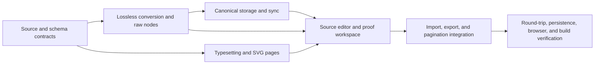

# Typst native editor execution

| Node | Owner / exclusive files                                                                        | Acceptance                                                                                 |
| ---- | ---------------------------------------------------------------------------------------------- | ------------------------------------------------------------------------------------------ |
| B    | Conversion worker: `typst/document*`, `extensions/raw-typst*`                                  | Source drives content; schema attributes and unknown source survive edits                  |
| C    | Runtime worker: existing Typst runtime/export/serializer modules, `typst/client*`, font assets | Local PDF plus actual paginated SVG; cancellation and diagnostics                          |
| D    | Storage worker: IDB, Convex sync/schema/integrations, Lix, collaboration, revision storage     | Additive migration, source-aware conflicts and round-trip sync                             |
| E, F | Coordinator: editor workspace, CodeMirror, route/menu, shared types and package configuration  | Recoverable source drafts, apply/undo, live proof, native import/export, Typst page counts |
| G    | Coordinator and owners                                                                         | Focused tests, typecheck, build, actual browser source-to-proof workflow                   |

Existing staged and unstaged changes are protected. No remote deployment or
release is part of this implementation. The HTML projection remains available to
publishing and AI, while Typst is the canonical saved manuscript.

## Completion record — 2026-09-28

Nodes B–F are implemented. The live editor has Write/Source/Proof modes, source
recovery and conflict protection, actual Typst page rendering, native imports,
source-aware revisions/sync, and canonical IndexedDB migration. Rich editing is
a continuous column; the former measurement paginator is no longer registered.

Verification:

- 68 focused Bun tests passed across conversion, real WASM compilation, export,
  session races, import, sync, and revisions (237 assertions).
- The Convex native-source roundtrip/legacy-write rejection test passed under
  Vitest. Convex tests use that runner, not Bun's test runner.
- Four Chromium tests passed, covering actual worker PDF/SVG output, local math/diagrams/fonts,
  IndexedDB migration/CAS/draft isolation, and the actual editor's invalid-source
  recovery, apply, proof, and reload flow.
- TypeScript, focused lint for the new editor/controller modules, and the
  production client build passed. Desktop and mobile proof/source captures were
  inspected; source/proof hide the rich formatting toolbar on both sizes.

The browser run exposed and fixed recursive `setEditable` update notifications.
Save-order tests protect newer typing from delayed autosaves and preserve local
source/rich edits when remote content arrives. Source-only edits are explicitly
checkpointed and sent to collaboration. Applying source also participates in the
visual editor's undo/redo history.

No cloud deployment or release was performed. The existing Electrobun hosted
shell was not converted into a separately bundled offline desktop frontend;
installer and native WebView validation remain outside this completion record.
